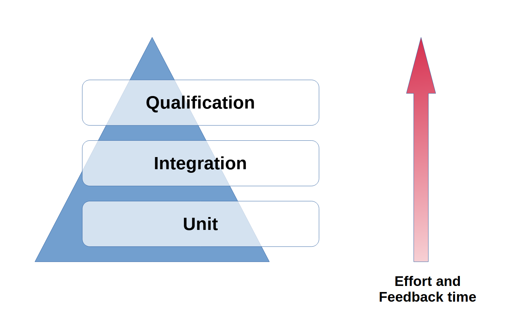

.. include:: .config.rst

.. revealjs-notes::

    **TODOs:**

    * a SW developer is happy because he has all the files in one place
    * scalable solution
    * system solution and not software solution
        * using RST to write text, diagrams and be traceable
    * explain **WHY** do we start from the bottom? A: legacy code and running projects
    * create a new project and integrate the component there with copy paste
    * show EPES results for develop and for a release branch
    * we only show features which are already implemented and can be used in your project
    * install extension to show the key presses

SPLE Demo
#########

A day in the life of a :green:`happy` SW developer.

Target audience
===============

.. revealjs-fragments::

    * Humans
    * :strike:`Chuck Norris`

.. revealjs-notes::

    As for the target audience, we have two groups ...

:transparent:`Chuck Norris vs Humans`
=====================================

.. revealjs-section::
   :data-background-image: _static/chuck_norris_vs_humans.png
   :data-background-size: contain

.. revealjs-notes::
    Luckily, we do not need to worry about what humans need to do.
    We have at least ...

Automotive Software Process Improvement and Capability Determination
====================================================================

.. revealjs-fragments::

    Automotive SPICE

:transparent:`A.SPICE 00`
=========================

.. revealjs-section::
   :data-background-image: _static/aspice_00.png
   :data-background-size: contain

.. revealjs-notes::
    These are all engineering processes, but we are interested in the software development process.

:transparent:`A.SPICE 02`
=========================

.. revealjs-section::
   :data-background-image: _static/aspice_02.png
   :data-background-size: contain

Why start there?
================

.. revealjs-break::
    :notitle:
    :data-auto-animate:

Low cost and high turnover

.. revealjs-notes::

    * Fastest feedback -> I can run the unit tests on my machine

Use case
========

Develop software for the `SPLed <https://github.com/avengineers/SPLed>`_ product.

.. revealjs-notes::
    
    We choose an example project:

    * generic and easy to explain
    * runs faster

Recap
=====

Component
---------

.. revealjs-fragments::
    :custom-effect: blur    

    * 🛠️ configurable
    * 🧩 transferable 
    * 😎 tested
    * 🔎 A.SPICE compliant

.. revealjs-notes::

    * configurable -> one component to be used in all product variants
    * transferable -> all files relevant for a component are in one place
    * tested -> the component is tested in all variants. All variants are guaranteed to work.
    * A.SPICE -> the component is compliant with the A.SPICE process

Component targets
-----------------

.. revealjs-fragments::

    * :yellow:`*_report` - software component report
    * :yellow:`*_unittests` - unit tests results
    * :yellow:`*_docs` - software detail design
    * :yellow:`*_object` - compile component

One more thing ...
==================

`MyProject <https://github.com/avengineers/MyProject>`_

Some interactivity
==================

.. revealjs-break::
    :notitle:
    :data-auto-animate:

.. revealjs-fragments::

    * CREATE
    * CHECK
    * DELIVER

.. revealjs-break::
    :notitle:
    :data-auto-animate:

* CREATE
* :yellow:`CHECK`
* DELIVER

.. revealjs-break::
    :notitle:
    :data-auto-animate:

* CREATE
* :yellow:`CHECK` 👈 against what?
* DELIVER

.. revealjs-break::
    :notitle:
    :data-auto-animate:

For me, a day without a :red:`bug` report is like ...

.. revealjs-break::
    :notitle:
    :data-auto-animate:

For me, a day without a :red:`bug` report is like ...

just kidding, I have no idea.

Some container
==============

.. container:: flex-container

   .. container:: half

    This is some text

    .. image:: _static/aspice_02.png
        :height: 100px
        :width: 200 px
        :scale: 50 %

   .. container:: half

    this is the other

:transparent:`A.SPICE 04`
=========================

.. revealjs-section::
   :data-background-image: _static/aspice_04.png
   :data-background-size: contain

Next steps
==========

* next level **SWE.2** + **SWE.5** = ❤️
* workshops (not trainings)
   * TDD for your component
   * SPLE for your project

